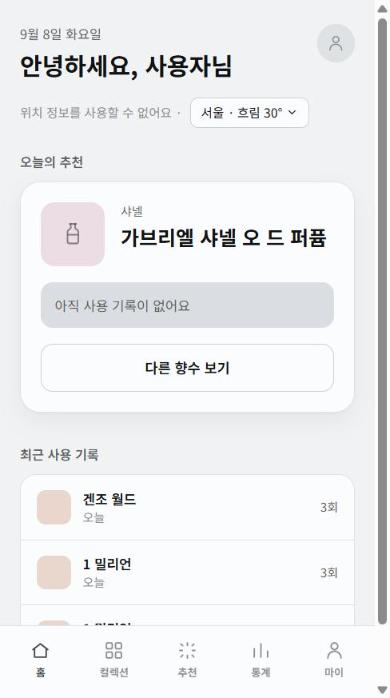
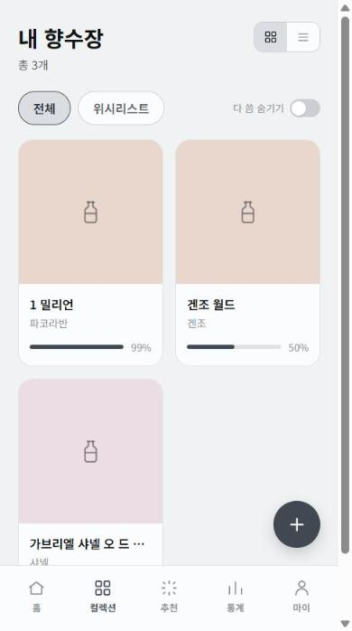
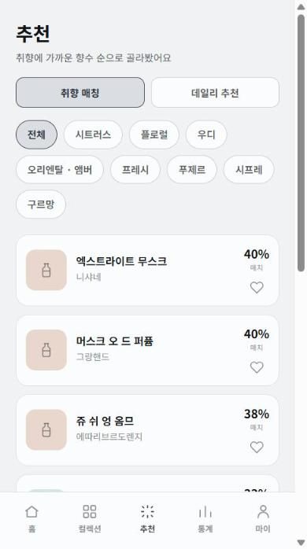
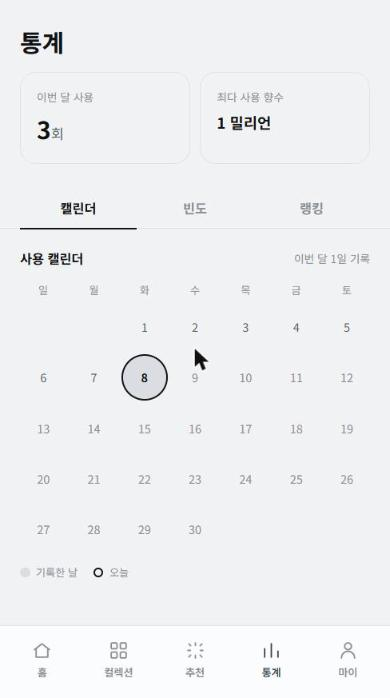

# Fragnote

내 향수장을 관리하고, 취향과 날씨에 맞는 향수를 추천받는 개인용 향수 앱.

상세 기획은 [docs/Fragnote_기획서.md](docs/Fragnote_기획서.md), 핵심 설계 결정은 [CLAUDE.md](CLAUDE.md) 참고.

## 화면

| 홈 | 내 향수장 |
| --- | --- |
|  |  |

| 추천 | 통계 |
| --- | --- |
|  |  |

## 핵심 기능

- **취향 매칭 + 데일리 추천 통합 엔진**: 취향 기반 추천과 날씨·최근 미사용·변질 위험을 반영한 데일리 추천을 하나의 엔진에서 파라미터로 분기해 처리
- **잔량 자동 추정**: 스프레이 횟수 × 용량 기반 자동 추정과 수동 보정을 결합한 하이브리드 방식으로 관리
- **향 변질 관리**: 개봉일 기준 경과 개월 수로 변질 위험도를 계산해 표시하고, 데일리 추천 가중치에도 반영
- **동일 향수 다중 보유 지원**: 정품/미니어처처럼 같은 향수를 여러 개 등록해도 구분 관리 가능

## 스택

- Next.js (App Router + Server Actions), TypeScript
- Prisma + PostgreSQL (로컬: Docker, 배포: Neon)
- Auth.js — 카카오/구글 로그인, JWT 세션 전략
- OpenWeatherMap (날씨 기반 추천)
- Vercel Blob (이미지)
- Recharts

## 로컬 개발 환경 설정

### 1. 의존성 설치

```bash
npm install
```

### 2. 환경 변수

`.env.example`을 복사해 `.env`를 만들고 값을 채운다.

```bash
cp .env.example .env
```

| 변수 | 설명 |
| --- | --- |
| `DATABASE_URL` | 로컬은 아래 Docker 설정값 그대로 사용 |
| `AUTH_SECRET` | `node -e "console.log(require('crypto').randomBytes(32).toString('base64'))"` 로 생성 |
| `AUTH_KAKAO_ID` / `AUTH_KAKAO_SECRET` | [Kakao Developers](https://developers.kakao.com) 에서 발급 |
| `AUTH_GOOGLE_ID` / `AUTH_GOOGLE_SECRET` | [Google Cloud Console](https://console.cloud.google.com) 에서 발급 |
| `OPENWEATHER_API_KEY` | [OpenWeatherMap](https://openweathermap.org/api) 에서 발급 (발급 직후엔 활성화까지 시간이 걸릴 수 있음) |
| `ANTHROPIC_API_KEY` | `scripts/generate-notes.mjs` (카탈로그 노트 시딩용) 실행 시에만 필요 |

카카오/구글 앱을 아직 등록하지 않았다면, 로그인 화면의 "개발용으로 시작하기" 버튼(NODE_ENV가 production이 아닐 때만 노출)으로 우회 로그인해서 화면을 확인할 수 있다.

### 3. DB 실행 및 마이그레이션

```bash
docker compose up -d
npm run db:migrate
```

### 4. 개발 서버 실행

```bash
npm run dev
```

[http://localhost:3000](http://localhost:3000) 에서 확인. **반드시 3000번 포트로 떠야 한다** — 다른 포트로 뜨면 아래 OAuth Redirect URI 설정과 안 맞아 로그인이 실패한다. 3000번이 이미 사용 중이면 해당 프로세스를 먼저 종료할 것.

## 배포 체크리스트

로컬(`http://localhost:3000`) 기준으로 등록해둔 설정들은 실제 도메인으로 배포할 때 별도로 추가해야 한다. **기존 로컬용 설정은 지우지 말고 추가**하면, 로컬 개발과 배포 환경을 동시에 계속 쓸 수 있다.

- [x] **DATABASE_URL** — 로컬 Docker 대신 Neon 등 실제 Postgres 연결 문자열로 교체
- [x] **카카오 로그인 (Kakao Developers > 카카오 로그인 > Redirect URI)**
  - `https://{배포 도메인}/api/auth/callback/kakao` 추가
- [x] **구글 로그인 (Google Cloud Console > 사용자 인증 정보 > 해당 OAuth 클라이언트)**
  - 승인된 자바스크립트 원본에 `https://{배포 도메인}` 추가
  - 승인된 리디렉션 URI에 `https://{배포 도메인}/api/auth/callback/google` 추가
- [x] **AUTH_SECRET** — 배포 환경에서도 값이 설정되어 있는지 확인 (로컬과 같은 값을 써도 되지만, 별도 값을 새로 생성해도 무방)
- [x] **OPENWEATHER_API_KEY / ANTHROPIC_API_KEY** — 도메인과 무관하게 그대로 복사하면 됨
- [ ] 배포 후 실제 도메인에서 카카오/구글 로그인이 되는지, 날씨 연동이 정상 동작하는지 직접 확인
- [ ] 로그인 화면의 "개발용으로 시작하기" 버튼이 배포 환경(`NODE_ENV=production`)에서 실제로 안 보이는지 확인
